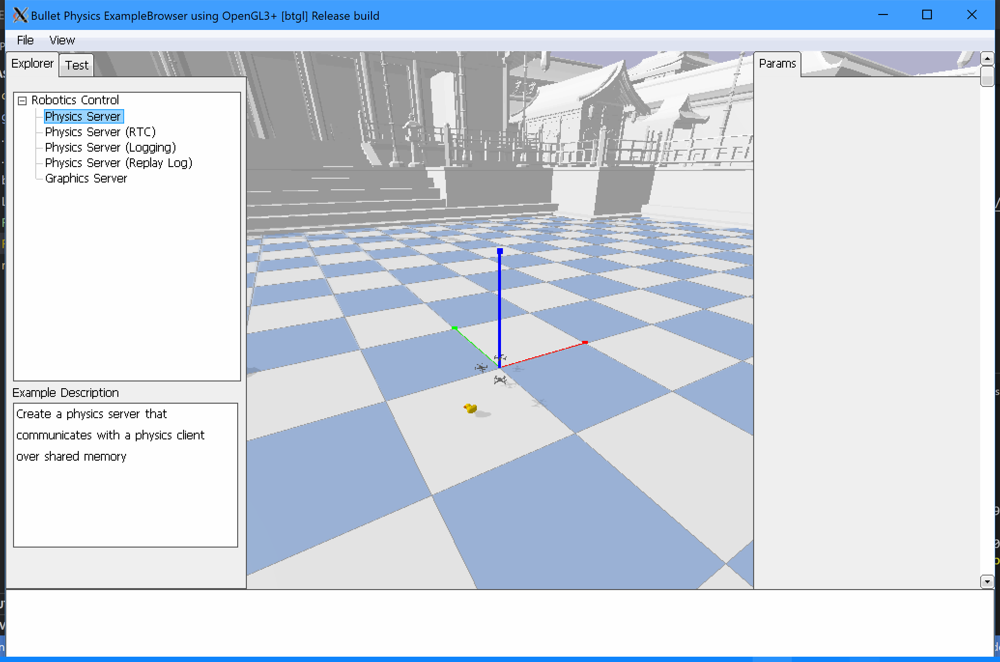

# Running UAS Sim in Docker Container on Windows

updated launch command:

xhost local:root
sudo docker run -it \
--env="DISPLAY=$DISPLAY" \
--env=NVIDIA_DRIVER_CAPABILITIES=all  \
--env=NVIDIA-VISIBLE_DEVICES=all \
--env="QT_X11_NO_MITSHM=1" \
--network="host" \
--privileged \
--volume="/tmp/.X11-unix:/tmp/.X11-unix:rw" \
--gpus all  \
--entrypoint /bin/bash uas_docker_env:1.0 

# Change setup.py in gym-pybullet-drones repository to the following before building: 

from setuptools import setup, find_packages

setup(
    name='gym_pybullet_drones',
    version='1.0.0',
    packages=find_packages(include=['gym_pybullet_drones', 'gym_pybullet_drones.*']),
    install_requires=[
        'numpy',
        'Pillow',
        'matplotlib',
        'cycler',
        'gym',
        'pybullet',
        'stable_baselines3',
        'ray[rllib]',
    ],
)
